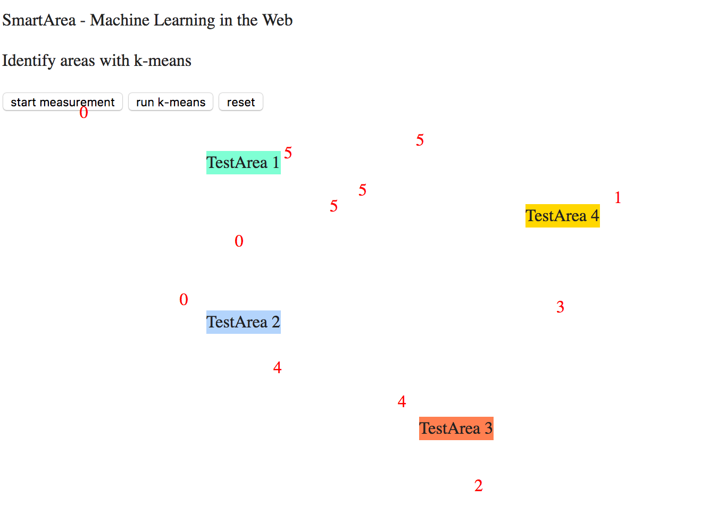

**Smart Machine Learning WebComponents**

This repo uses the ml.js MachineLearning JavaScript Library.
Using browserify to make node packages available in the browser.

**Showcases:**

* SmartArea
* SmartComponents
* SmartWizards

__SmartArea__ is using unsupervised learning with __k-means__ algorithm to identify user relevant areas on the webpage.

__SmartComponent__ is using supervised learning with a __CART decision tree__ to train and identify if a web component is for
interest for the user.
Run `browserify ./js/smartcomponents.js -o ./js/smartcomponentsBundled.js` when updating
source code.

__SmartWizard__ is using supervised learning and __multiple linear regression__ to identify the read speed of the user and
automatically forward to the next section after the learning epoch.

